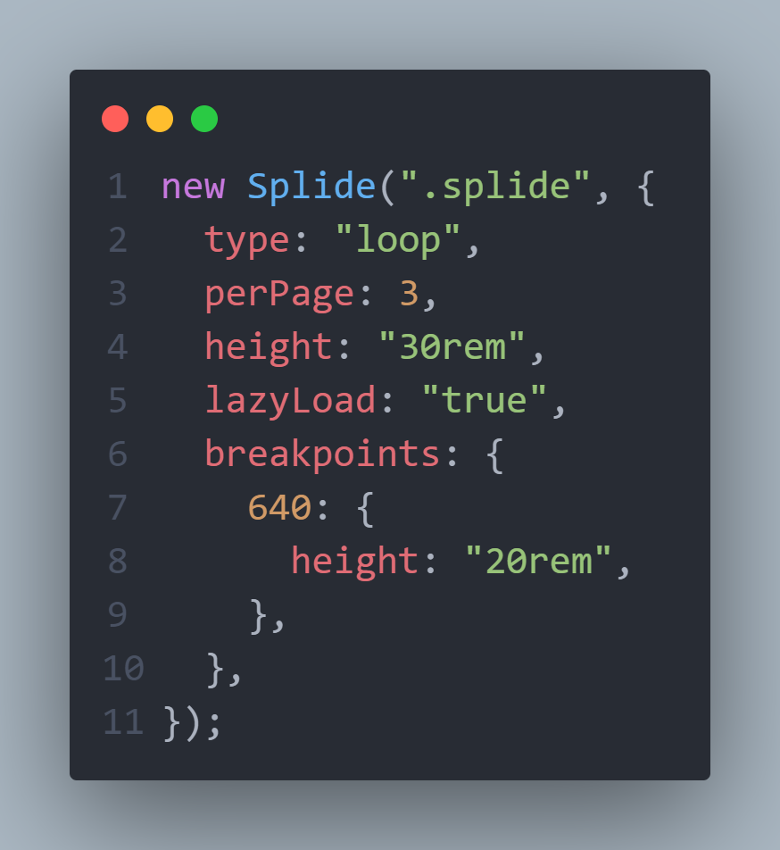

# Manage Landing Page

This is a solution to the **Manage Landing Page** challenge from [Frontend Mentor](https://frontendmentor.io)

## Preview

Get a glance of the project solution.


## Tools and Languages

Different tools and languages used to create this project.

### Tools

- Visual Studio Code
- [Vite](https://vitejs.dev)
- Firefox
- Brave
- [Validator - A library to validate forms](https://npmjs.com/package/validator)
- [Bootstrap Icons](https://icons.getbootstrap.com)
- [Splide](https://splidejs.com/)

### Languages

- SCSS
- HTML
- CSS
- JavaScript

## Process

How I started creating this project with the help of Vite.

### Creating Application and installing dependencies

```
npm create vite@latest -- --template vanilla app
```

This will create a new Vite application with some boilerplate code.

```
cd app

npm install
```

Then we need to `cd`(change directory) into the `app` folder and install all the dependencies using `npm install`

### Installing SASS/SCSS dependency

```
npm add sass -D
```

This command will install the SCSS package so that Vite can compile our SCSS to CSS.

```
npm run dev
```

This command will open a dev server on your local machine.

### Using Splide to create the carousel

Creating an interactive and responsive carousel with Splider.

### Linking Splide with cdn

Link Splide with core js and css styles using the CDN

```html
<!-- Javascript for Splide -->
<script src="https://cdn.jsdelivr.net/npm/@splidejs/splide@4.1.4/dist/js/splide.min.js"></script>

<!-- Default CSS styles for Splide -->
<link
  href="https://cdn.jsdelivr.net/npm/@splidejs/splide@4.1.4/dist/css/splide.min.css"
  rel="stylesheet"
/>
```

We need to create the markup that will work accordingly with Splider.


This is the first time I'm creating a carousel and thankfully, this library helped me create it without a hassle.



## What I learned making this project

I was able to enhance my CSS `grid` and `flex` knowledge and create some complex layouts included in this design.

Also, learned to make buttons that look and feel good to the eyes with a balanced color, spacing and size.

## Links

- Live site URL: [Netlify](https://manage-landing-code-beaker.netlify.app/)
- Repository URL: [Code-Beaker/manage-landing-page](https://github.com/Code-Beaker/manage-landing-page-code-beaker)
